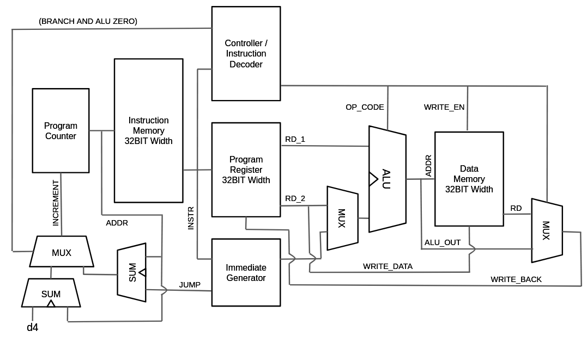

# Custom RISCV (RV32I) Soft Core for Arty S7 FPGA

## Specifications
 - Development Board: Arty S7-25
 - FPGA: Spartan-7
 - Architecture: RISC-V
 - Standard: RV32I
 - RTL Language: SystemVerilog
 - Clock Speed: 50MHz / 100MHz (Target)

## Current Status
| Component | RTL Code (SysVerilog) | Testbench | Hardware Implemented |
| -- | -- | -- | -- |
| Program Counter | WIP | WIP | WIP |
| Instruction Mem | WIP | WIP | WIP |
| Controller / Decoder | WIP | WIP | WIP |
| Program Register | WIP | WIP | WIP |
| Immediate Generator | WIP | WIP | WIP |
| Arithmetic Logic Unit | DONE | WIP | WIP |
| Data Memory | WIP | WIP | WIP |
| TOP | WIP | WIP | WIP |

## Description
### TOP Module
>The rough architecture of the CPU is shown below.


### Program Counter
> WIP
### Instruction Memory
> WIP
### Controller and Decoder
> WIP
### Program Register
> WIP
### Immediate Generator
> WIP
### Arithmetic Logic Unit
The ALU uses a simple combinational circuit that executes based on the op_code produced by the controller. Basic operations include the following:
- ADD Sums A and B
- SUB Subtracts B from A
- SLL Shifts A left by B
- SLT Sets if A is less than B
- XOR Produces A ^ B
- SRL Shifts A right by B, inserting 1'b0
- SRA Shifts A right by B, inserting MSB of A
- OR Produces A + B
- AND Produces A.B
```systemverilog
op_ADD: begin
    arith_total = {1'b0, data_in_A} + {1'b0, data_in_B};
    data_out = arit_total[31:0];
end
op_SUB: begin
    arith_total = {1'b0, data_in_A} - {1'b0, data_in_B};
    data_out = arit_total[31:0];
end
op_SLL: data_out = data_in_A << data_in_B[4:0];
op_SLT: data_out = ($signed(data_in_A) < $signed(data_in_B)) ? 32'h00000001 : 32'b0;
op_SLTU: data_out = (data_in_A < data_in_B) ? 32'h00000001 : 32'b0;
op_XOR: data_out = data_in_A ^ data_in_B;
op_SRL: data_out = data_in_A >> data_in_B[4:0];
op_SRA: data_out = $signed(data_in_A) >>> data_in_B[4:0];
op_OR: data_out = data_in_A | data_in_B;
op_AND: data_out = data_in_A & data_in_B;
default: data_out = 32'b0;
```
### Data Memory
> WIP