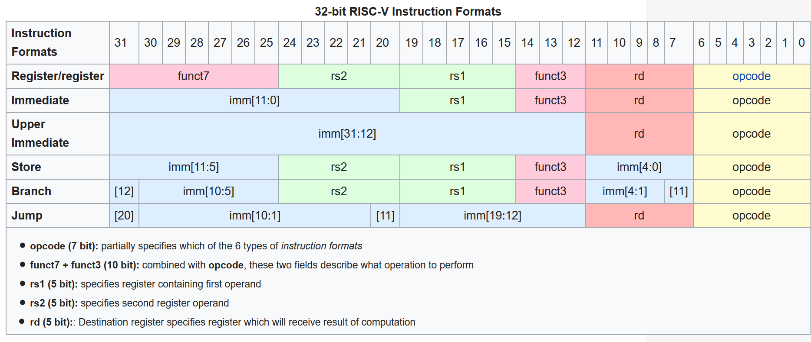

# Custom RISCV (RV32I) Soft Core for Arty S7 FPGA

## Specifications
 - Development Board: Arty S7-25
 - FPGA: Spartan-7
 - Architecture: RISC-V
 - Standard: RV32I
 - RTL Language: SystemVerilog
 - Clock Speed: 50MHz / 100MHz (Target)

## Current Status
| Component | RTL Code (SysVerilog) | Testbench | Hardware Implemented |
| -- | -- | -- | -- |
| Program Counter | DONE | WIP | WIP |
| Instruction Mem | DONE | WIP | WIP |
| Controller / Decoder | DONE | WIP | WIP |
| Program Register | DONE | WIP | WIP |
| Immediate Generator | DONE | WIP | WIP |
| Arithmetic Logic Unit | DONE | DONE | WIP |
| Data Memory | DONE | WIP | WIP |
| TOP | DONE | WIP | WIP |

## Description
### TOP Module
>The rough architecture of the CPU is shown below.


### Program Counter
The Program Counter either increments by 4 with each CLK cycle, or jumps to a specific address with J-type operations.
```systemverilog
always_comb begin
    next_address = jump_en ? jump : address + 32'd4;
end
```
### Instruction Memory
The Instruction Memory is a simple dual port memory block, with Port A being read-only and Port B being write-only. The block has width of 32 bit and depth of 1024 words.
```systemverilog
//Port A read-only
always_ff @(posedge clk) begin
    if(en_A) data_out_A <= memory[addr_A[11:2]];
end

//Port B write-only
always_ff @(posedge clk) begin
    if(en_B) begin
        if(write_en_B) memory[addr_B[9:0]] <= write_data_B;
    end
end
```
### Controller and Decoder
RISC Controller decodes the instruction and outputs the appropriate signals for the ALU, Data Memory, Immediate Generator and the various MUX. Listed below are the various I/O signals.
```systemverilog
input logic [31:0] instr,

output logic reg_write,
output logic mem_write,
output logic mem_read,
output logic branch,
output logic jump,
output logic [3:0] alu_control,
output logic alu_src,
output logic result_sel
```
### Program Register
The Program Register stores temporary variables in random access asynchronous registers that mainly interacts with the ALU. rs1, rs2 and rd is decoded from the instruction. Two seperate signals, rs1 and rs2 selects the two read port addresses, while rd selects the write port address for writeback from the ALU output. Memory location 0x is blocked and hardwired to 31'b0.
```systemverilog
assign data_out_A = (rs1 == 5'b0) ? 32'b0 : memory[rs1];
assign data_out_B = (rs2 == 5'b0) ? 32'b0 : memory[rs2];

always_ff @(posedge clk) begin
    if(write_en && (rd != 5'b0)) begin
        memory[rd] <= write_back;
    end
end
```
### Immediate Generator
The Immediate Generator produces a [31:0] result used for other calculations based on the opcode and corresponding imm instructions as shown below.


> Instruction Set Picture from Wikipedia.

```systemverilog
immediate,
JALR,
load: imm_gen = {{20{instr[31]}}, instr[31:20]};
store: imm_gen = {{20{instr[31]}}, instr[31:25], instr[11:7]};
branch: imm_gen = {{20{instr[31]}}, instr[7], instr[30:25], instr[11:8], 1'b0};
LUI: imm_gen = {instr[31:12], 12'b0};
JAL: imm_gen = {{12{instr[31]}}, instr[19:12], instr[20], instr[30:21], 1'b0};
default: imm_gen = 32'b0;
```
### Arithmetic Logic Unit
The ALU uses a simple combinational circuit that executes based on the op_code produced by the controller. Basic operations include the following:
- ADD Sums A and B
- SUB Subtracts B from A
- SLL Shifts A left by B
- SLT Sets if A is less than B
- XOR Produces A ^ B
- SRL Shifts A right by B, inserting 1'b0
- SRA Shifts A right by B, inserting MSB of A
- OR Produces A + B
- AND Produces A.B
```systemverilog
op_ADD: begin
    arith_total = {1'b0, data_in_A} + {1'b0, data_in_B};
    data_out = arit_total[31:0];
end
op_SUB: begin
    arith_total = {1'b0, data_in_A} - {1'b0, data_in_B};
    data_out = arit_total[31:0];
end
op_SLL: data_out = data_in_A << data_in_B[4:0];
op_SLT: data_out = ($signed(data_in_A) < $signed(data_in_B)) ? 32'h00000001 : 32'b0;
op_SLTU: data_out = (data_in_A < data_in_B) ? 32'h00000001 : 32'b0;
op_XOR: data_out = data_in_A ^ data_in_B;
op_SRL: data_out = data_in_A >> data_in_B[4:0];
op_SRA: data_out = $signed(data_in_A) >>> data_in_B[4:0];
op_OR: data_out = data_in_A | data_in_B;
op_AND: data_out = data_in_A & data_in_B;
default: data_out = 32'b0;
```
### Data Memory
The Data Memory is a simple BRAM inference with 32 bit width.
```systemverilog
always_ff @(posedge clk) begin
        if(mem_read) data_out <= memory[addr[11:2]];
        if(write_en) memory[addr[11:2]] <= write_data;
    end
```
